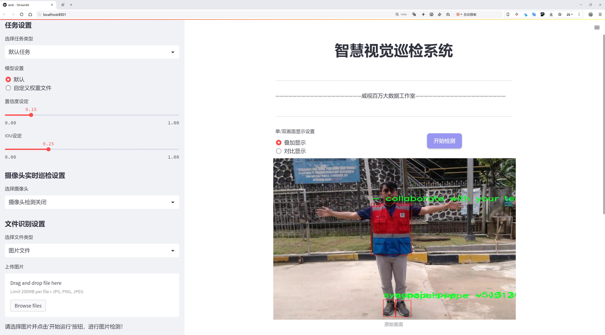
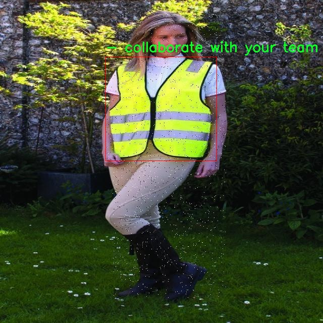

# 防护装备穿戴与否检测检测系统源码分享
 # [一条龙教学YOLOV8标注好的数据集一键训练_70+全套改进创新点发刊_Web前端展示]

### 1.研究背景与意义

项目参考[AAAI Association for the Advancement of Artificial Intelligence](https://gitee.com/qunmasj/projects)

项目来源[AACV Association for the Advancement of Computer Vision](https://kdocs.cn/l/cszuIiCKVNis)

研究背景与意义

随着工业化进程的加快，安全生产问题日益凸显，尤其是在建筑、制造和化工等高风险行业，个人防护装备（PPE）的穿戴情况直接关系到从业人员的生命安全和健康。尽管各类安全法规和标准相继出台，但由于人为因素、管理疏漏及培训不足等原因，防护装备的穿戴率仍然不尽如人意。为了有效提升安全管理水平，减少工伤事故的发生，开发一种高效、智能的防护装备穿戴检测系统显得尤为重要。

近年来，计算机视觉技术的快速发展为安全管理提供了新的解决方案。YOLO（You Only Look Once）系列目标检测算法因其高效性和实时性，已成为计算机视觉领域的研究热点。YOLOv8作为该系列的最新版本，具备更强的特征提取能力和更快的检测速度，适合在复杂环境中进行实时监测。基于YOLOv8的防护装备穿戴检测系统，能够通过视频监控实时识别和判断工人是否正确穿戴了必要的防护装备，从而及时发出警报，降低安全隐患。

本研究基于PPE-DETECTION数据集，包含1900张图像，涵盖了9个类别，包括安全靴、手套、头盔、反向类别（未穿戴的装备）以及工人本身。该数据集的多样性和丰富性为模型的训练和验证提供了良好的基础。通过对这些图像的分析，系统不仅能够识别出工人是否穿戴了安全装备，还能够具体指出缺失的装备类型。这种精准的检测能力，能够为企业提供实时的安全监控，提升安全管理的科学性和有效性。

在实际应用中，防护装备穿戴检测系统的推广将有助于建立安全文化，增强员工的安全意识。通过实时监测和反馈，员工能够及时意识到自身的安全隐患，从而自觉遵守安全规定，形成良好的安全习惯。此外，该系统还可以为企业提供数据支持，帮助管理层分析安全隐患的发生频率和原因，进而制定更为有效的安全管理措施。

综上所述，基于改进YOLOv8的防护装备穿戴与否检测系统，不仅具有重要的学术研究价值，也具有广泛的实际应用前景。通过该系统的研发与应用，能够有效提升工业安全管理水平，降低工伤事故发生率，为实现安全生产提供有力保障。这一研究的开展，必将为推动智能安全管理的发展贡献新的思路和方法。

### 2.图片演示




##### 注意：由于此博客编辑较早，上面“2.图片演示”和“3.视频演示”展示的系统图片或者视频可能为老版本，新版本在老版本的基础上升级如下：（实际效果以升级的新版本为准）

  （1）适配了YOLOV8的“目标检测”模型和“实例分割”模型，通过加载相应的权重（.pt）文件即可自适应加载模型。

  （2）支持“图片识别”、“视频识别”、“摄像头实时识别”三种识别模式。

  （3）支持“图片识别”、“视频识别”、“摄像头实时识别”三种识别结果保存导出，解决手动导出（容易卡顿出现爆内存）存在的问题，识别完自动保存结果并导出到tempDir中。

  （4）支持Web前端系统中的标题、背景图等自定义修改，后面提供修改教程。

  另外本项目提供训练的数据集和训练教程,暂不提供权重文件（best.pt）,需要您按照教程进行训练后实现图片演示和Web前端界面演示的效果。

### 3.视频演示

[3.1 视频演示](https://www.bilibili.com/video/BV1e4sDe9EW3/)

### 4.数据集信息展示

##### 4.1 本项目数据集详细数据（类别数＆类别名）

nc: 5
names: ['-', '- collaborate with your team on computer vision projects', 'Roboflow is an end-to-end computer vision platform that helps you', 'This dataset was exported via roboflow.com on November 16- 2023 at 1-56 AM GMT', 'synapsis-ppe - v513 2023-11-16 8-53am']


##### 4.2 本项目数据集信息介绍

数据集信息展示

在构建和优化防护装备穿戴与否检测系统的过程中，数据集的选择和质量至关重要。本项目所使用的数据集名为“ppe-detection”，它专门用于训练改进YOLOv8模型，以提高在各种环境中对防护装备穿戴情况的检测能力。该数据集包含了丰富的图像数据，旨在为计算机视觉领域的研究人员和开发者提供高效的解决方案，以确保在工业、医疗等关键领域中，人员的安全和合规性。

“ppe-detection”数据集包含五个类别，虽然类别名称中有一些信息可能并不直接与防护装备相关，但它们的存在为数据集的多样性和应用场景提供了重要的背景。具体来说，这五个类别的设定不仅涵盖了防护装备的不同类型，还反映了在实际应用中可能遇到的各种情况和挑战。通过对这些类别的深入分析和理解，研究人员能够更好地训练YOLOv8模型，从而提升其在真实场景中的表现。

该数据集的导出时间为2023年11月16日，标志着其在数据收集和整理过程中的时效性。及时更新的数据集对于防护装备检测系统的准确性和可靠性至关重要，因为防护装备的设计和使用标准可能会随着时间的推移而发生变化。因此，使用最新的数据集可以确保模型能够适应当前的行业标准和最佳实践，从而提高其在实际应用中的有效性。

此外，数据集的多样性和丰富性为模型的训练提供了坚实的基础。通过包含不同场景、不同光照条件以及不同背景的图像，研究人员能够训练出更为鲁棒的模型。这种鲁棒性在实际应用中尤为重要，因为防护装备的穿戴情况可能会受到多种因素的影响，如环境变化、人员活动等。因此，利用“ppe-detection”数据集进行训练，能够帮助YOLOv8模型更好地识别和判断防护装备的穿戴情况，从而在实际应用中提供更高的准确率和更低的误报率。

在项目的实施过程中，团队将充分利用“ppe-detection”数据集中的信息，进行数据预处理、增强和标注，以确保模型训练的有效性。通过不断迭代和优化，最终目标是构建一个高效、准确的防护装备穿戴检测系统，能够在各类环境中实时监测和反馈，从而为用户提供更安全的工作环境。

综上所述，“ppe-detection”数据集不仅为本项目提供了必要的基础数据支持，也为改进YOLOv8模型的训练和应用奠定了坚实的基础。通过对该数据集的深入挖掘和应用，研究团队将能够推动防护装备检测技术的发展，为相关行业的安全管理提供有力的技术保障。





### 5.全套项目环境部署视频教程（零基础手把手教学）

[5.1 环境部署教程链接（零基础手把手教学）](https://www.ixigua.com/7404473917358506534?logTag=c807d0cbc21c0ef59de5)


[5.2 安装Python虚拟环境创建和依赖库安装视频教程链接（零基础手把手教学）](https://www.ixigua.com/7404474678003106304?logTag=1f1041108cd1f708b01a)

### 6.手把手YOLOV8训练视频教程（零基础小白有手就能学会）

[6.1 手把手YOLOV8训练视频教程（零基础小白有手就能学会）](https://www.ixigua.com/7404477157818401292?logTag=d31a2dfd1983c9668658)

### 7.70+种全套YOLOV8创新点代码加载调参视频教程（一键加载写好的改进模型的配置文件）

[7.1 70+种全套YOLOV8创新点代码加载调参视频教程（一键加载写好的改进模型的配置文件）](https://www.ixigua.com/7404478314661806627?logTag=29066f8288e3f4eea3a4)

### 8.70+种全套YOLOV8创新点原理讲解（非科班也可以轻松写刊发刊，V10版本正在科研待更新）

由于篇幅限制，每个创新点的具体原理讲解就不一一展开，具体见下列网址中的创新点对应子项目的技术原理博客网址【Blog】：


[8.1 70+种全套YOLOV8创新点原理讲解链接](https://gitee.com/qunmasj/good)

### 9.系统功能展示（检测对象为举例，实际内容以本项目数据集为准）

图9.1.系统支持检测结果表格显示

  图9.2.系统支持置信度和IOU阈值手动调节

  图9.3.系统支持自定义加载权重文件best.pt(需要你通过步骤5中训练获得)

  图9.4.系统支持摄像头实时识别

  图9.5.系统支持图片识别

  图9.6.系统支持视频识别

  图9.7.系统支持识别结果文件自动保存

  图9.8.系统支持Excel导出检测结果数据


### 10.原始YOLOV8算法原理

原始YOLOv8算法原理

YOLOv8算法是目标检测领域中的一项重要进展，它在YOLO系列的基础上进行了多项创新与改进，旨在提升检测精度和速度。该算法的架构依然遵循了YOLO系列的经典设计理念，主要由输入层、主干网络、特征融合层（Neck）和解耦头（Head）组成。尽管YOLOv8的论文尚未正式发表，但其在YOLOv5和YOLOv7的基础上所做的优化与创新，使其成为当前的最先进（SOTA）目标检测算法之一。

在YOLOv8的主干网络中，依旧采用了YOLOv5的CSPDarknet结构，但进行了关键性的改进。具体而言，YOLOv8将YOLOv5中的C3模块替换为C2f模块，这一变化不仅实现了模型的轻量化，还在保持检测精度的同时，增强了特征提取的能力。C2f模块的设计灵感来源于YOLOv7的ELAN结构，它通过引入多条分支连接来增强模型的梯度流，从而有效缓解深层网络中的梯度消失问题。C2f模块由多个CBS（卷积+归一化+SiLU激活）模块和Bottleneck网络组成，能够在保持输入输出特征图尺寸一致的情况下，提取更加丰富的特征信息。

YOLOv8在特征融合层的设计上采用了PAN-FPN（Path Aggregation Network with Feature Pyramid Network）结构，这一结构旨在实现多尺度特征的深度融合。通过自下而上的上采样与自上而下的特征融合，YOLOv8能够有效整合来自不同层次的特征信息，提升目标检测的准确性。在这一过程中，YOLOv8对YOLOv5的上采样阶段进行了优化，去除了1x1卷积层，并通过C2f模块进行特征的进一步处理，从而实现了更高效的特征融合。

值得注意的是，YOLOv8在目标检测的策略上做出了显著的转变，采用了Anchor-Free的思想，抛弃了传统的Anchor-Based方法。这一创新使得YOLOv8在处理小目标和复杂背景时，能够更好地适应各种场景，提升了检测的灵活性和准确性。YOLOv8的样本匹配策略也进行了更新，从静态匹配转变为Task-Aligned的Assigner匹配方式，这一变化使得模型在训练过程中能够更有效地学习到目标的特征。

在损失函数的设计上，YOLOv8引入了VFLLoss作为分类损失，同时结合DFLLoss和CIoULoss作为回归损失。这一组合不仅提高了模型对样本不平衡的适应能力，还增强了对小目标的检测性能。Focal Loss的引入，尤其是在处理目标数量不均衡的情况下，显著提升了模型的学习效率，使得YOLOv8在复杂场景下的表现更加出色。

数据预处理是YOLOv8训练过程中的另一个重要环节。虽然在某些应用中不启用数据预处理，但YOLOv8通常采用包括马赛克增强、混合增强、空间扰动和颜色扰动等多种数据增强手段，以提高模型的泛化能力和鲁棒性。输入图像经过640x640的缩放后，进入到主干网络进行特征提取，整个过程通过卷积层、归一化层和激活函数的组合，确保了特征的有效提取和模型的快速收敛。

在YOLOv8的解耦头部分，网络结构借鉴了YOLOX和YOLOv6的设计理念，取消了objectness分支，通过边框回归和目标分类的解耦处理，使得模型在分类和回归任务上能够独立优化。这一设计不仅提高了模型的灵活性，还有效减少了计算量，提升了检测速度。YOLOv8的Head部分输出的特征图尺度为80x80、40x40和20x20，能够在不同的尺度上进行目标检测，确保了对各种大小目标的有效识别。

综上所述，YOLOv8算法通过对主干网络、特征融合层和解耦头的优化与创新，显著提升了目标检测的性能。其在Anchor-Free策略、损失函数设计和数据预处理等方面的改进，使得YOLOv8在复杂环境下的目标检测能力得到了增强，展现出更高的准确性和速度。这些创新不仅推动了YOLO系列的发展，也为目标检测领域的研究提供了新的思路和方向。随着YOLOv8的不断应用与优化，未来在实际场景中的表现将更加令人期待。


### 11.项目核心源码讲解（再也不用担心看不懂代码逻辑）

#### 11.1 code\ultralytics\utils\instance.py

以下是经过简化和注释的核心代码，保留了最重要的部分，便于理解和使用。

```python
# Ultralytics YOLO 🚀, AGPL-3.0 license

import numpy as np
from collections import abc
from itertools import repeat
from numbers import Number
from typing import List

# 定义一个用于将单个值转换为元组的函数
def _ntuple(n):
    """将输入转换为n元组。"""
    def parse(x):
        """解析输入，返回元组或重复的值。"""
        return x if isinstance(x, abc.Iterable) else tuple(repeat(x, n))
    return parse

# 定义将2元组和4元组的转换函数
to_2tuple = _ntuple(2)
to_4tuple = _ntuple(4)

# 定义支持的边界框格式
_formats = ["xyxy", "xywh", "ltwh"]

class Bboxes:
    """
    处理边界框的类，支持多种格式（'xyxy', 'xywh', 'ltwh'）。
    """
    def __init__(self, bboxes, format="xyxy") -> None:
        """初始化Bboxes类，检查格式和维度。"""
        assert format in _formats, f"无效的边界框格式: {format}"
        bboxes = bboxes[None, :] if bboxes.ndim == 1 else bboxes
        assert bboxes.ndim == 2 and bboxes.shape[1] == 4
        self.bboxes = bboxes
        self.format = format

    def convert(self, format):
        """转换边界框格式。"""
        assert format in _formats, f"无效的边界框格式: {format}"
        if self.format == format:
            return
        # 根据当前格式和目标格式选择转换函数
        func = self._get_conversion_function(format)
        self.bboxes = func(self.bboxes)
        self.format = format

    def _get_conversion_function(self, format):
        """根据当前格式和目标格式返回相应的转换函数。"""
        if self.format == "xyxy":
            return xyxy2xywh if format == "xywh" else xyxy2ltwh
        elif self.format == "xywh":
            return xywh2xyxy if format == "xyxy" else xywh2ltwh
        else:
            return ltwh2xyxy if format == "xyxy" else ltwh2xywh

    def areas(self):
        """计算并返回每个边界框的面积。"""
        self.convert("xyxy")  # 确保格式为xyxy
        return (self.bboxes[:, 2] - self.bboxes[:, 0]) * (self.bboxes[:, 3] - self.bboxes[:, 1])

    def mul(self, scale):
        """按比例缩放边界框。"""
        if isinstance(scale, Number):
            scale = to_4tuple(scale)
        assert isinstance(scale, (tuple, list)) and len(scale) == 4
        self.bboxes[:, 0] *= scale[0]  # 左上角x
        self.bboxes[:, 1] *= scale[1]  # 左上角y
        self.bboxes[:, 2] *= scale[2]  # 右下角x
        self.bboxes[:, 3] *= scale[3]  # 右下角y

    def add(self, offset):
        """添加偏移量到边界框。"""
        if isinstance(offset, Number):
            offset = to_4tuple(offset)
        assert isinstance(offset, (tuple, list)) and len(offset) == 4
        self.bboxes[:, 0] += offset[0]
        self.bboxes[:, 1] += offset[1]
        self.bboxes[:, 2] += offset[2]
        self.bboxes[:, 3] += offset[3]

    def __len__(self):
        """返回边界框的数量。"""
        return len(self.bboxes)

    @classmethod
    def concatenate(cls, boxes_list: List["Bboxes"], axis=0) -> "Bboxes":
        """
        将多个Bboxes对象连接成一个新的Bboxes对象。
        """
        assert isinstance(boxes_list, (list, tuple)) and boxes_list
        assert all(isinstance(box, Bboxes) for box in boxes_list)
        return cls(np.concatenate([b.bboxes for b in boxes_list], axis=axis))

class Instances:
    """
    包含图像中检测到的对象的边界框、分段和关键点的容器。
    """
    def __init__(self, bboxes, segments=None, keypoints=None, bbox_format="xywh", normalized=True) -> None:
        """初始化Instances对象。"""
        self._bboxes = Bboxes(bboxes=bboxes, format=bbox_format)
        self.keypoints = keypoints
        self.normalized = normalized
        self.segments = segments

    def convert_bbox(self, format):
        """转换边界框格式。"""
        self._bboxes.convert(format=format)

    @property
    def bbox_areas(self):
        """计算边界框的面积。"""
        return self._bboxes.areas()

    def scale(self, scale_w, scale_h, bbox_only=False):
        """按比例缩放边界框、分段和关键点。"""
        self._bboxes.mul(scale=(scale_w, scale_h, scale_w, scale_h))
        if not bbox_only:
            self.segments[..., 0] *= scale_w
            self.segments[..., 1] *= scale_h
            if self.keypoints is not None:
                self.keypoints[..., 0] *= scale_w
                self.keypoints[..., 1] *= scale_h

    def __getitem__(self, index) -> "Instances":
        """
        使用索引获取特定实例或一组实例。
        """
        segments = self.segments[index] if self.segments is not None else None
        keypoints = self.keypoints[index] if self.keypoints is not None else None
        bboxes = self._bboxes[index]
        return Instances(bboxes=bboxes, segments=segments, keypoints=keypoints, bbox_format=self._bboxes.format, normalized=self.normalized)

    def __len__(self):
        """返回实例的数量。"""
        return len(self._bboxes)

    @classmethod
    def concatenate(cls, instances_list: List["Instances"], axis=0) -> "Instances":
        """
        将多个Instances对象连接成一个新的Instances对象。
        """
        assert isinstance(instances_list, (list, tuple)) and instances_list
        assert all(isinstance(instance, Instances) for instance in instances_list)
        cat_boxes = np.concatenate([ins.bboxes for ins in instances_list], axis=axis)
        cat_segments = np.concatenate([ins.segments for ins in instances_list], axis=axis)
        cat_keypoints = np.concatenate([ins.keypoints for ins in instances_list], axis=axis) if instances_list[0].keypoints is not None else None
        return cls(cat_boxes, cat_segments, cat_keypoints, bbox_format=instances_list[0]._bboxes.format, normalized=instances_list[0].normalized)

    @property
    def bboxes(self):
        """返回边界框。"""
        return self._bboxes.bboxes
```

### 代码说明：
1. **Bboxes类**：用于处理边界框的创建、格式转换、面积计算等功能。
2. **Instances类**：用于管理图像中检测到的对象，包括边界框、分段和关键点的处理。
3. **转换函数**：根据不同的边界框格式（如xyxy、xywh、ltwh）进行转换。
4. **缩放和偏移**：提供了对边界框进行缩放和偏移的功能。
5. **连接功能**：支持将多个边界框或实例对象连接成一个新的对象。

这些核心功能使得边界框的管理和操作变得高效且易于使用。

这个文件是一个用于处理边界框（bounding boxes）的Python模块，主要用于计算机视觉任务中，特别是在目标检测中。它定义了两个主要的类：`Bboxes`和`Instances`，分别用于管理边界框和图像中检测到的对象的实例。

首先，`Bboxes`类用于处理边界框的创建、转换和操作。它支持三种边界框格式：`xyxy`（左上角和右下角坐标）、`xywh`（中心坐标和宽高）以及`ltwh`（左上角坐标和宽高）。在初始化时，用户需要提供一个包含边界框的numpy数组和格式类型。该类提供了多种方法来转换边界框格式、计算面积、缩放和偏移边界框等。

在`Bboxes`类中，`convert`方法可以将边界框从一种格式转换为另一种格式，`areas`方法计算所有边界框的面积，`mul`和`add`方法分别用于缩放和偏移边界框的坐标。此外，`__getitem__`方法允许通过索引获取特定的边界框。

接下来，`Instances`类是一个更复杂的容器，用于存储图像中检测到的对象的边界框、分割和关键点。它内部使用`Bboxes`类来处理边界框，并提供了对分割和关键点的支持。用户可以在创建`Instances`对象时提供边界框、分割和关键点数据。该类同样提供了转换边界框格式、缩放、归一化和去除零面积框等功能。

`Instances`类还包括了一些用于处理图像翻转和裁剪的方法，例如`flipud`和`fliplr`，用于在图像翻转时调整边界框和关键点的位置。`clip`方法则确保所有边界框和关键点都在图像边界内。`remove_zero_area_boxes`方法用于移除那些在裁剪后变为零面积的边界框。

最后，两个类都提供了`concatenate`方法，允许将多个`Bboxes`或`Instances`对象合并为一个新的对象。这对于处理批量数据时非常有用。

总体来说，这个模块提供了一个灵活且功能强大的接口，用于处理计算机视觉任务中的边界框和对象实例，适用于YOLO等目标检测算法的实现。

#### 11.2 ui.py

以下是代码中最核心的部分，并附上详细的中文注释：

```python
import sys
import subprocess

def run_script(script_path):
    """
    使用当前 Python 环境运行指定的脚本。

    Args:
        script_path (str): 要运行的脚本路径

    Returns:
        None
    """
    # 获取当前 Python 解释器的路径
    python_path = sys.executable

    # 构建运行命令，使用 streamlit 运行指定的脚本
    command = f'"{python_path}" -m streamlit run "{script_path}"'

    # 执行命令，并等待其完成
    result = subprocess.run(command, shell=True)
    
    # 检查命令执行的返回码，如果不为0则表示出错
    if result.returncode != 0:
        print("脚本运行出错。")

# 实例化并运行应用
if __name__ == "__main__":
    # 指定要运行的脚本路径
    script_path = "web.py"  # 这里可以直接指定脚本名，假设它在当前目录下

    # 调用函数运行脚本
    run_script(script_path)
```

### 代码注释说明：
1. **导入模块**：
   - `sys`：用于访问与 Python 解释器相关的变量和函数。
   - `subprocess`：用于创建新进程、连接到它们的输入/输出/错误管道，并获得返回码。

2. **`run_script` 函数**：
   - 定义了一个函数，接受一个参数 `script_path`，表示要运行的 Python 脚本的路径。
   - 使用 `sys.executable` 获取当前 Python 解释器的路径，以确保在当前环境中运行脚本。
   - 构建一个命令字符串，使用 `streamlit` 模块运行指定的脚本。
   - 使用 `subprocess.run` 执行构建的命令，并等待其完成。
   - 检查命令的返回码，如果返回码不为0，表示脚本运行出错，打印错误信息。

3. **主程序部分**：
   - 使用 `if __name__ == "__main__":` 确保只有在直接运行该脚本时才会执行以下代码。
   - 指定要运行的脚本路径（在这里假设为 "web.py"）。
   - 调用 `run_script` 函数，传入脚本路径以执行该脚本。

这个程序文件名为 `ui.py`，其主要功能是使用当前的 Python 环境来运行一个指定的脚本，具体是通过 Streamlit 框架来启动一个 Web 应用。

程序首先导入了必要的模块，包括 `sys`、`os` 和 `subprocess`，这些模块提供了与系统交互的功能。特别是 `subprocess` 模块，它允许程序生成新的进程、连接到它们的输入/输出/错误管道，并获取返回码。

接下来，程序定义了一个名为 `run_script` 的函数，该函数接受一个参数 `script_path`，表示要运行的脚本的路径。在函数内部，首先通过 `sys.executable` 获取当前 Python 解释器的路径。然后，构建一个命令字符串，该命令使用当前的 Python 解释器来运行指定的脚本，具体的命令格式为 `python -m streamlit run script_path`。这个命令的作用是启动 Streamlit 应用。

随后，使用 `subprocess.run` 方法执行构建好的命令。该方法的 `shell=True` 参数允许在 shell 中执行命令。执行完命令后，程序检查返回码，如果返回码不为 0，表示脚本运行出错，程序会打印出错误信息。

在文件的最后部分，程序通过 `if __name__ == "__main__":` 语句来判断是否是直接运行该脚本。如果是，则指定要运行的脚本路径为 `web.py`，并调用 `run_script` 函数来执行这个脚本。

总的来说，这个程序的功能是为用户提供一个简单的接口，通过指定的脚本路径来启动一个 Streamlit Web 应用。

#### 11.3 70+种YOLOv8算法改进源码大全和调试加载训练教程（非必要）\ultralytics\models\yolo\pose\val.py

以下是代码中最核心的部分，并附上详细的中文注释：

```python
class PoseValidator(DetectionValidator):
    """
    PoseValidator类，继承自DetectionValidator类，用于基于姿态模型的验证。
    """

    def __init__(self, dataloader=None, save_dir=None, pbar=None, args=None, _callbacks=None):
        """初始化PoseValidator对象，设置自定义参数和属性。"""
        super().__init__(dataloader, save_dir, pbar, args, _callbacks)  # 调用父类构造函数
        self.sigma = None  # 初始化sigma，用于计算OKS
        self.kpt_shape = None  # 初始化关键点形状
        self.args.task = 'pose'  # 设置任务类型为姿态估计
        self.metrics = PoseMetrics(save_dir=self.save_dir, on_plot=self.on_plot)  # 初始化姿态度量
        if isinstance(self.args.device, str) and self.args.device.lower() == 'mps':
            LOGGER.warning("WARNING ⚠️ Apple MPS known Pose bug. Recommend 'device=cpu' for Pose models.")

    def preprocess(self, batch):
        """预处理批次数据，将关键点数据转换为浮点数并移动到指定设备。"""
        batch = super().preprocess(batch)  # 调用父类的预处理方法
        batch['keypoints'] = batch['keypoints'].to(self.device).float()  # 将关键点数据转移到设备并转换为浮点数
        return batch

    def postprocess(self, preds):
        """应用非极大值抑制，返回高置信度的检测结果。"""
        return ops.non_max_suppression(preds,
                                       self.args.conf,
                                       self.args.iou,
                                       labels=self.lb,
                                       multi_label=True,
                                       agnostic=self.args.single_cls,
                                       max_det=self.args.max_det,
                                       nc=self.nc)

    def update_metrics(self, preds, batch):
        """更新度量指标。"""
        for si, pred in enumerate(preds):  # 遍历每个预测结果
            idx = batch['batch_idx'] == si  # 获取当前批次的索引
            cls = batch['cls'][idx]  # 获取当前批次的类别
            bbox = batch['bboxes'][idx]  # 获取当前批次的边界框
            kpts = batch['keypoints'][idx]  # 获取当前批次的关键点
            nl, npr = cls.shape[0], pred.shape[0]  # 类别数量和预测数量
            nk = kpts.shape[1]  # 关键点数量
            shape = batch['ori_shape'][si]  # 原始图像形状
            correct_kpts = torch.zeros(npr, self.niou, dtype=torch.bool, device=self.device)  # 初始化正确关键点矩阵
            correct_bboxes = torch.zeros(npr, self.niou, dtype=torch.bool, device=self.device)  # 初始化正确边界框矩阵
            self.seen += 1  # 增加已处理的样本数量

            if npr == 0:  # 如果没有预测结果
                if nl:  # 如果有标签
                    self.stats.append((correct_bboxes, correct_kpts, *torch.zeros((2, 0), device=self.device), cls.squeeze(-1)))
                continue  # 跳过当前循环

            # 处理预测结果
            if self.args.single_cls:
                pred[:, 5] = 0  # 如果是单类模式，将类别索引设置为0
            predn = pred.clone()  # 克隆预测结果
            ops.scale_boxes(batch['img'][si].shape[1:], predn[:, :4], shape, ratio_pad=batch['ratio_pad'][si])  # 将预测框缩放到原始图像空间
            pred_kpts = predn[:, 6:].view(npr, nk, -1)  # 获取预测的关键点
            ops.scale_coords(batch['img'][si].shape[1:], pred_kpts, shape, ratio_pad=batch['ratio_pad'][si])  # 缩放关键点坐标

            # 评估
            if nl:  # 如果有标签
                height, width = batch['img'].shape[2:]  # 获取图像的高度和宽度
                tbox = ops.xywh2xyxy(bbox) * torch.tensor((width, height, width, height), device=self.device)  # 将目标框转换为xyxy格式
                ops.scale_boxes(batch['img'][si].shape[1:], tbox, shape, ratio_pad=batch['ratio_pad'][si])  # 缩放目标框
                tkpts = kpts.clone()  # 克隆关键点
                tkpts[..., 0] *= width  # 缩放x坐标
                tkpts[..., 1] *= height  # 缩放y坐标
                tkpts = ops.scale_coords(batch['img'][si].shape[1:], tkpts, shape, ratio_pad=batch['ratio_pad'][si])  # 缩放关键点坐标
                labelsn = torch.cat((cls, tbox), 1)  # 合并类别和目标框
                correct_bboxes = self._process_batch(predn[:, :6], labelsn)  # 处理边界框
                correct_kpts = self._process_batch(predn[:, :6], labelsn, pred_kpts, tkpts)  # 处理关键点

            # 记录统计信息
            self.stats.append((correct_bboxes, correct_kpts, pred[:, 4], pred[:, 5], cls.squeeze(-1)))

    def _process_batch(self, detections, labels, pred_kpts=None, gt_kpts=None):
        """
        返回正确的预测矩阵。

        参数:
            detections (torch.Tensor): 形状为[N, 6]的检测结果张量。
            labels (torch.Tensor): 形状为[M, 5]的标签张量。
            pred_kpts (torch.Tensor, optional): 形状为[N, 51]的预测关键点张量。
            gt_kpts (torch.Tensor, optional): 形状为[N, 51]的真实关键点张量。

        返回:
            torch.Tensor: 形状为[N, 10]的正确预测矩阵。
        """
        if pred_kpts is not None and gt_kpts is not None:
            area = ops.xyxy2xywh(labels[:, 1:])[:, 2:].prod(1) * 0.53  # 计算区域
            iou = kpt_iou(gt_kpts, pred_kpts, sigma=self.sigma, area=area)  # 计算关键点的IoU
        else:  # 处理边界框
            iou = box_iou(labels[:, 1:], detections[:, :4])  # 计算边界框的IoU

        return self.match_predictions(detections[:, 5], labels[:, 0], iou)  # 返回匹配的预测结果
```

以上代码展示了`PoseValidator`类的核心部分，包括初始化、预处理、后处理、更新度量指标和处理批次数据的逻辑。每个方法都有详细的中文注释，解释了其功能和实现细节。

这个程序文件是用于YOLOv8模型的姿态估计验证的实现，继承自`DetectionValidator`类，主要用于对姿态模型的验证过程进行管理和计算。程序的核心功能包括数据预处理、模型预测、指标计算和结果可视化等。

首先，程序导入了必要的库和模块，包括路径处理、NumPy、PyTorch以及Ultralytics提供的各种工具和函数。接着定义了`PoseValidator`类，类的构造函数初始化了一些参数，包括数据加载器、保存目录、进度条、参数和回调函数等。特别地，构造函数中设置了任务类型为“pose”，并初始化了姿态估计的指标。

在`preprocess`方法中，程序对输入的批次数据进行预处理，将关键点数据转换为浮点数并移动到指定的设备上。`get_desc`方法则返回评估指标的描述信息，便于后续的结果展示。

`postprocess`方法实现了非极大值抑制，过滤掉低置信度的检测结果。`init_metrics`方法用于初始化姿态估计的指标，判断关键点的形状并设置相应的标准差。

`update_metrics`方法是核心功能之一，它计算每个预测的正确性。程序通过比较预测结果和真实标签，计算出正确的边界框和关键点，并更新统计信息。如果设置了保存JSON的选项，程序还会将预测结果保存为JSON格式。

`_process_batch`方法用于处理每个批次的检测结果，计算交并比（IoU）并返回正确的预测矩阵。`plot_val_samples`和`plot_predictions`方法用于可视化验证集样本和模型预测结果，生成带有预测边界框和关键点的图像。

最后，`pred_to_json`方法将YOLO的预测结果转换为COCO格式的JSON文件，`eval_json`方法则使用COCO格式的JSON文件评估模型的性能，计算mAP（平均精度）等指标，并输出评估结果。

整体来看，这个程序文件实现了姿态估计模型的验证流程，包括数据处理、模型推理、指标计算和结果可视化，为用户提供了一个完整的验证框架。

#### 11.4 train.py

以下是代码中最核心的部分，并附上详细的中文注释：

```python
class DetectionTrainer(BaseTrainer):
    """
    扩展自 BaseTrainer 类的检测模型训练类。
    用于训练 YOLO 检测模型。
    """

    def build_dataset(self, img_path, mode="train", batch=None):
        """
        构建 YOLO 数据集。

        参数:
            img_path (str): 包含图像的文件夹路径。
            mode (str): 模式，`train` 表示训练模式，`val` 表示验证模式。
            batch (int, optional): 批次大小，仅用于 `rect` 模式。默认为 None。
        """
        gs = max(int(de_parallel(self.model).stride.max() if self.model else 0), 32)
        return build_yolo_dataset(self.args, img_path, batch, self.data, mode=mode, rect=mode == "val", stride=gs)

    def get_dataloader(self, dataset_path, batch_size=16, rank=0, mode="train"):
        """构造并返回数据加载器。"""
        assert mode in ["train", "val"]  # 确保模式有效
        with torch_distributed_zero_first(rank):  # 仅在 DDP 中初始化数据集 *.cache 一次
            dataset = self.build_dataset(dataset_path, mode, batch_size)  # 构建数据集
        shuffle = mode == "train"  # 训练模式下打乱数据
        if getattr(dataset, "rect", False) and shuffle:
            LOGGER.warning("WARNING ⚠️ 'rect=True' 与 DataLoader 的 shuffle 不兼容，设置 shuffle=False")
            shuffle = False
        workers = self.args.workers if mode == "train" else self.args.workers * 2  # 设置工作线程数
        return build_dataloader(dataset, batch_size, workers, shuffle, rank)  # 返回数据加载器

    def preprocess_batch(self, batch):
        """对一批图像进行预处理，包括缩放和转换为浮点数。"""
        batch["img"] = batch["img"].to(self.device, non_blocking=True).float() / 255  # 转换为浮点数并归一化
        if self.args.multi_scale:  # 如果启用多尺度
            imgs = batch["img"]
            sz = (
                random.randrange(self.args.imgsz * 0.5, self.args.imgsz * 1.5 + self.stride)
                // self.stride
                * self.stride
            )  # 随机选择尺寸
            sf = sz / max(imgs.shape[2:])  # 计算缩放因子
            if sf != 1:
                ns = [
                    math.ceil(x * sf / self.stride) * self.stride for x in imgs.shape[2:]
                ]  # 计算新的形状
                imgs = nn.functional.interpolate(imgs, size=ns, mode="bilinear", align_corners=False)  # 进行插值缩放
            batch["img"] = imgs  # 更新图像
        return batch

    def set_model_attributes(self):
        """设置模型的属性，包括类别数量和名称。"""
        self.model.nc = self.data["nc"]  # 将类别数量附加到模型
        self.model.names = self.data["names"]  # 将类别名称附加到模型
        self.model.args = self.args  # 将超参数附加到模型

    def get_model(self, cfg=None, weights=None, verbose=True):
        """返回 YOLO 检测模型。"""
        model = DetectionModel(cfg, nc=self.data["nc"], verbose=verbose and RANK == -1)  # 创建检测模型
        if weights:
            model.load(weights)  # 加载权重
        return model

    def get_validator(self):
        """返回用于 YOLO 模型验证的 DetectionValidator。"""
        self.loss_names = "box_loss", "cls_loss", "dfl_loss"  # 定义损失名称
        return yolo.detect.DetectionValidator(
            self.test_loader, save_dir=self.save_dir, args=copy(self.args), _callbacks=self.callbacks
        )

    def plot_training_samples(self, batch, ni):
        """绘制带有注释的训练样本。"""
        plot_images(
            images=batch["img"],
            batch_idx=batch["batch_idx"],
            cls=batch["cls"].squeeze(-1),
            bboxes=batch["bboxes"],
            paths=batch["im_file"],
            fname=self.save_dir / f"train_batch{ni}.jpg",
            on_plot=self.on_plot,
        )

    def plot_metrics(self):
        """从 CSV 文件中绘制指标。"""
        plot_results(file=self.csv, on_plot=self.on_plot)  # 保存结果图
```

### 代码核心部分说明：
1. **DetectionTrainer 类**：该类负责训练 YOLO 检测模型，继承自 `BaseTrainer`。
2. **build_dataset 方法**：构建数据集，支持训练和验证模式。
3. **get_dataloader 方法**：构造数据加载器，支持多线程和数据打乱。
4. **preprocess_batch 方法**：对输入的图像批次进行预处理，包括归一化和缩放。
5. **set_model_attributes 方法**：设置模型的类别数量和名称。
6. **get_model 方法**：返回 YOLO 检测模型，并可加载预训练权重。
7. **get_validator 方法**：返回用于模型验证的验证器。
8. **plot_training_samples 和 plot_metrics 方法**：用于可视化训练样本和训练指标。

这个程序文件 `train.py` 是一个用于训练 YOLO（You Only Look Once）目标检测模型的脚本，继承自 `BaseTrainer` 类。文件中定义了一个 `DetectionTrainer` 类，主要负责构建数据集、加载数据、预处理图像、设置模型属性、获取模型、验证模型、记录损失、显示训练进度以及绘制训练样本和指标等功能。

在 `DetectionTrainer` 类中，`build_dataset` 方法用于构建 YOLO 数据集，接收图像路径、模式（训练或验证）和批量大小作为参数。该方法会根据模型的步幅（stride）来调整数据集的构建。

`get_dataloader` 方法则用于创建数据加载器，确保在分布式训练中只初始化一次数据集，并根据模式选择是否打乱数据顺序。该方法还会根据模式设置工作线程的数量。

`preprocess_batch` 方法负责对图像批次进行预处理，包括将图像缩放到合适的大小并转换为浮点数。它支持多尺度训练，通过随机选择图像大小来增强模型的鲁棒性。

`set_model_attributes` 方法用于设置模型的属性，包括类别数量和类别名称，以便模型能够正确处理数据。

`get_model` 方法用于返回一个 YOLO 检测模型，并可选择加载预训练权重。

`get_validator` 方法返回一个用于验证 YOLO 模型的验证器，能够计算损失并进行模型评估。

`label_loss_items` 方法用于返回带有标签的训练损失项的字典，便于监控训练过程中的损失变化。

`progress_string` 方法生成一个格式化的字符串，用于显示训练进度，包括当前的轮次、GPU 内存使用情况、损失值、实例数量和图像大小等信息。

`plot_training_samples` 方法用于绘制训练样本及其标注，帮助可视化训练数据的质量。

最后，`plot_metrics` 和 `plot_training_labels` 方法分别用于绘制训练过程中的指标和创建带标签的训练图，便于分析模型的性能和训练效果。

总体而言，这个文件提供了一个完整的框架，用于训练 YOLO 模型，支持多种功能和灵活的配置选项，以适应不同的训练需求。

#### 11.5 70+种YOLOv8算法改进源码大全和调试加载训练教程（非必要）\ultralytics\nn\extra_modules\RFAConv.py

以下是保留的核心代码部分，并附上详细的中文注释：

```python
import torch
import torch.nn as nn
from einops import rearrange

class h_sigmoid(nn.Module):
    """实现h-sigmoid激活函数"""
    def __init__(self, inplace=True):
        super(h_sigmoid, self).__init__()
        self.relu = nn.ReLU6(inplace=inplace)  # 使用ReLU6作为基础

    def forward(self, x):
        return self.relu(x + 3) / 6  # 计算h-sigmoid

class h_swish(nn.Module):
    """实现h-swish激活函数"""
    def __init__(self, inplace=True):
        super(h_swish, self).__init__()
        self.sigmoid = h_sigmoid(inplace=inplace)  # 使用h-sigmoid作为基础

    def forward(self, x):
        return x * self.sigmoid(x)  # 计算h-swish

class RFAConv(nn.Module):
    """RFAConv模块，使用可学习的加权卷积"""
    def __init__(self, in_channel, out_channel, kernel_size, stride=1):
        super().__init__()
        self.kernel_size = kernel_size

        # 生成权重的卷积层
        self.get_weight = nn.Sequential(
            nn.AvgPool2d(kernel_size=kernel_size, padding=kernel_size // 2, stride=stride),
            nn.Conv2d(in_channel, in_channel * (kernel_size ** 2), kernel_size=1, groups=in_channel, bias=False)
        )
        
        # 生成特征的卷积层
        self.generate_feature = nn.Sequential(
            nn.Conv2d(in_channel, in_channel * (kernel_size ** 2), kernel_size=kernel_size, padding=kernel_size // 2, stride=stride, groups=in_channel, bias=False),
            nn.BatchNorm2d(in_channel * (kernel_size ** 2)),
            nn.ReLU()
        )
        
        # 最终的卷积层
        self.conv = nn.Conv2d(in_channel, out_channel, kernel_size=kernel_size, stride=kernel_size)

    def forward(self, x):
        b, c = x.shape[0:2]  # 获取批次大小和通道数
        weight = self.get_weight(x)  # 计算权重
        h, w = weight.shape[2:]  # 获取特征图的高和宽
        weighted = weight.view(b, c, self.kernel_size ** 2, h, w).softmax(2)  # 计算权重的softmax
        feature = self.generate_feature(x).view(b, c, self.kernel_size ** 2, h, w)  # 生成特征
        weighted_data = feature * weighted  # 加权特征
        conv_data = rearrange(weighted_data, 'b c (n1 n2) h w -> b c (h n1) (w n2)', n1=self.kernel_size, n2=self.kernel_size)  # 重排特征
        return self.conv(conv_data)  # 返回卷积结果

class SE(nn.Module):
    """Squeeze-and-Excitation模块"""
    def __init__(self, in_channel, ratio=16):
        super(SE, self).__init__()
        self.gap = nn.AdaptiveAvgPool2d((1, 1))  # 全局平均池化
        self.fc = nn.Sequential(
            nn.Linear(in_channel, ratio, bias=False),  # 从c到c/r
            nn.ReLU(),
            nn.Linear(ratio, in_channel, bias=False),  # 从c/r到c
            nn.Sigmoid()
        )

    def forward(self, x):
        b, c = x.shape[0:2]  # 获取批次大小和通道数
        y = self.gap(x).view(b, c)  # 进行全局平均池化并展平
        y = self.fc(y).view(b, c, 1, 1)  # 通过全连接层
        return y  # 返回通道注意力

class RFCBAMConv(nn.Module):
    """RFCBAMConv模块，结合了通道注意力和特征生成"""
    def __init__(self, in_channel, out_channel, kernel_size=3, stride=1):
        super().__init__()
        self.kernel_size = kernel_size
        self.generate = nn.Sequential(
            nn.Conv2d(in_channel, in_channel * (kernel_size ** 2), kernel_size, padding=kernel_size // 2, stride=stride, groups=in_channel, bias=False),
            nn.BatchNorm2d(in_channel * (kernel_size ** 2)),
            nn.ReLU()
        )
        self.get_weight = nn.Sequential(nn.Conv2d(2, 1, kernel_size=3, padding=1, bias=False), nn.Sigmoid())  # 计算权重
        self.se = SE(in_channel)  # Squeeze-and-Excitation模块

        self.conv = nn.Conv2d(in_channel, out_channel, kernel_size=kernel_size, stride=kernel_size)  # 最终卷积层

    def forward(self, x):
        b, c = x.shape[0:2]  # 获取批次大小和通道数
        channel_attention = self.se(x)  # 计算通道注意力
        generate_feature = self.generate(x)  # 生成特征

        h, w = generate_feature.shape[2:]  # 获取特征图的高和宽
        generate_feature = generate_feature.view(b, c, self.kernel_size ** 2, h, w)  # 重排特征
        generate_feature = rearrange(generate_feature, 'b c (n1 n2) h w -> b c (h n1) (w n2)', n1=self.kernel_size, n2=self.kernel_size)  # 重排特征

        unfold_feature = generate_feature * channel_attention  # 加权特征
        max_feature, _ = torch.max(generate_feature, dim=1, keepdim=True)  # 最大特征
        mean_feature = torch.mean(generate_feature, dim=1, keepdim=True)  # 平均特征
        receptive_field_attention = self.get_weight(torch.cat((max_feature, mean_feature), dim=1))  # 计算感受野注意力
        conv_data = unfold_feature * receptive_field_attention  # 加权后的特征
        return self.conv(conv_data)  # 返回卷积结果
```

### 代码说明
1. **h_sigmoid 和 h_swish**: 这两个类实现了h-sigmoid和h-swish激活函数，常用于深度学习模型中，能够增强模型的非线性表达能力。
2. **RFAConv**: 这是一个卷积模块，使用可学习的加权机制来生成特征，并通过softmax对权重进行归一化，最后通过卷积层输出结果。
3. **SE**: Squeeze-and-Excitation模块用于增强通道间的特征表达，通过全局平均池化和全连接层生成通道注意力。
4. **RFCBAMConv**: 结合了通道注意力和特征生成的卷积模块，利用Squeeze-and-Excitation模块来计算通道注意力，并通过最大和平均池化来计算感受野注意力，最终输出加权后的特征。

该程序文件实现了YOLOv8算法中的一些改进模块，主要包括RFAConv、RFCBAMConv和RFCAConv等。文件中使用了PyTorch框架，定义了一些自定义的神经网络层，旨在提高模型的特征提取能力和表达能力。

首先，文件导入了必要的库，包括PyTorch的核心库和一些自定义的卷积模块。接着，定义了两个激活函数类：h_sigmoid和h_swish。h_sigmoid是一个经过修改的sigmoid函数，h_swish则是将h_sigmoid与输入相乘，形成了一种新的激活函数，这些激活函数在深度学习中常用于提高模型的非线性表达能力。

RFAConv类是一个自定义的卷积层，包含了一些新的特征生成和加权机制。该层通过平均池化和卷积操作生成权重，并对输入特征进行加权，最后通过一个卷积层输出结果。其核心思想是通过对特征进行加权来增强模型对重要特征的关注。

RFCBAMConv类在RFAConv的基础上增加了通道注意力机制。它通过全局平均池化生成通道注意力权重，并结合特征生成的过程来提升特征的表达能力。该类通过对生成的特征进行加权，并结合最大池化和均值池化的结果，来进一步增强特征的表达。

RFCAConv类则结合了RFAConv和通道注意力机制，增加了对空间信息的关注。它通过自适应平均池化操作分别获取特征的高度和宽度信息，并将这些信息结合后通过卷积层生成最终的输出。这个类的设计使得模型能够更好地捕捉到空间特征的相关性。

整体来看，这些模块的设计旨在通过引入新的特征生成和加权机制，以及通道和空间注意力机制，来提升YOLOv8模型在目标检测任务中的性能。这些改进可以帮助模型更有效地学习和提取图像中的重要特征，从而提高检测精度。

#### 11.6 code\ultralytics\utils\callbacks\comet.py

以下是代码中最核心的部分，并附上详细的中文注释：

```python
# 导入必要的库
from ultralytics.utils import LOGGER, RANK, SETTINGS, TESTS_RUNNING, ops
import os
from pathlib import Path

# 检查是否在测试运行中，避免记录pytest日志
try:
    assert not TESTS_RUNNING  # 确保不是在测试中
    assert SETTINGS["comet"] is True  # 确保Comet集成已启用
    import comet_ml  # 导入Comet库

    assert hasattr(comet_ml, "__version__")  # 确保comet_ml是一个有效的包

except (ImportError, AssertionError):
    comet_ml = None  # 如果导入失败，则将comet_ml设置为None

def _create_experiment(args):
    """创建Comet实验对象，确保在分布式训练中只在一个进程中创建。"""
    if RANK not in (-1, 0):  # 仅在主进程中创建实验
        return
    try:
        comet_mode = _get_comet_mode()  # 获取Comet模式
        _project_name = os.getenv("COMET_PROJECT_NAME", args.project)  # 获取项目名称
        experiment = _get_experiment_type(comet_mode, _project_name)  # 创建实验对象
        experiment.log_parameters(vars(args))  # 记录参数
        # 记录其他设置
        experiment.log_others(
            {
                "eval_batch_logging_interval": _get_eval_batch_logging_interval(),
                "log_confusion_matrix_on_eval": _should_log_confusion_matrix(),
                "log_image_predictions": _should_log_image_predictions(),
                "max_image_predictions": _get_max_image_predictions_to_log(),
            }
        )
        experiment.log_other("Created from", "yolov8")  # 记录创建来源

    except Exception as e:
        LOGGER.warning(f"WARNING ⚠️ Comet installed but not initialized correctly, not logging this run. {e}")

def on_train_epoch_end(trainer):
    """在每个训练周期结束时记录指标和保存批次图像。"""
    experiment = comet_ml.get_global_experiment()  # 获取当前的Comet实验
    if not experiment:
        return  # 如果没有实验，则返回

    metadata = _fetch_trainer_metadata(trainer)  # 获取训练器元数据
    curr_epoch = metadata["curr_epoch"]  # 当前周期
    curr_step = metadata["curr_step"]  # 当前步骤

    # 记录训练损失指标
    experiment.log_metrics(trainer.label_loss_items(trainer.tloss, prefix="train"), step=curr_step, epoch=curr_epoch)

    if curr_epoch == 1:  # 如果是第一个周期，记录训练批次图像
        _log_images(experiment, trainer.save_dir.glob("train_batch*.jpg"), curr_step)

def on_train_end(trainer):
    """在训练结束时执行操作。"""
    experiment = comet_ml.get_global_experiment()  # 获取当前的Comet实验
    if not experiment:
        return  # 如果没有实验，则返回

    metadata = _fetch_trainer_metadata(trainer)  # 获取训练器元数据
    curr_epoch = metadata["curr_epoch"]  # 当前周期
    curr_step = metadata["curr_step"]  # 当前步骤

    _log_model(experiment, trainer)  # 记录最佳训练模型
    _log_confusion_matrix(experiment, trainer, curr_step, curr_epoch)  # 记录混淆矩阵
    _log_image_predictions(experiment, trainer.validator, curr_step)  # 记录图像预测
    experiment.end()  # 结束实验

# 回调函数字典
callbacks = (
    {
        "on_pretrain_routine_start": on_pretrain_routine_start,
        "on_train_epoch_end": on_train_epoch_end,
        "on_fit_epoch_end": on_fit_epoch_end,
        "on_train_end": on_train_end,
    }
    if comet_ml
    else {}
)
```

### 代码核心部分说明：
1. **实验创建**：`_create_experiment` 函数负责创建Comet实验对象，并记录相关参数和设置。
2. **训练周期结束处理**：`on_train_epoch_end` 函数在每个训练周期结束时记录训练损失和图像。
3. **训练结束处理**：`on_train_end` 函数在训练结束时记录模型、混淆矩阵和图像预测，并结束实验。
4. **回调函数**：`callbacks` 字典用于存储不同阶段的回调函数，以便在训练过程中自动调用。

这个程序文件是一个用于集成 Comet.ml 的回调函数模块，主要用于在训练 YOLO 模型时记录实验数据和结果。文件中首先导入了一些必要的库和模块，并进行了一些基本的检查，比如确保 Comet.ml 库已正确安装且集成设置已启用。

接下来，文件定义了一些辅助函数，用于获取环境变量中的配置，例如 Comet 的运行模式、模型名称、评估批次日志记录间隔、最大图像预测数量等。这些函数帮助用户根据自己的需求灵活配置 Comet 的行为。

文件中还定义了一些与数据处理相关的函数，包括将 YOLO 模型的预测结果和真实标签格式化为 Comet 可以记录的格式，以及将边界框的坐标从缩放后的图像形状转换回原始图像形状。这些函数确保在记录时数据的准确性和一致性。

在训练过程中，文件会根据不同的训练阶段（如预训练开始、每个训练周期结束、拟合周期结束和训练结束）调用相应的回调函数。在这些回调函数中，程序会记录训练的指标、保存模型、记录混淆矩阵、记录图像预测结果等。这些操作有助于用户在 Comet.ml 上监控和分析模型的训练过程。

此外，文件还处理了分布式训练的情况，确保在多个进程中只创建一个实验对象。通过这种方式，用户可以有效地管理和记录实验数据，而不必担心数据的重复或丢失。

最后，文件将所有的回调函数汇总到一个字典中，只有在 Comet.ml 可用时才会激活这些回调。这种设计使得代码具有良好的可扩展性和灵活性，便于在不同的环境中使用。

### 12.系统整体结构（节选）

### 整体功能和构架概括

该程序库主要是针对YOLOv8目标检测模型的实现与改进，包含了训练、验证、模型结构、回调机制等多个模块。整体架构旨在提供一个灵活、可扩展的框架，便于用户进行模型训练、评估和实验记录。各个模块通过清晰的接口进行交互，确保了代码的可维护性和可读性。

- **数据处理与模型训练**：通过 `train.py` 和 `val.py` 实现模型的训练和验证，支持多种数据集和训练配置。
- **模型结构与改进**：`RFAConv.py` 提供了改进的卷积层，增强了模型的特征提取能力。
- **回调机制**：通过 `comet.py` 和 `tensorboard.py` 实现了对训练过程的监控和结果记录，支持与外部工具的集成。
- **工具与实用函数**：`instance.py`、`ops.py`、`triton.py` 等模块提供了数据处理、操作和其他实用功能，支持主训练和验证流程。

### 文件功能整理表

| 文件路径                                                                                                   | 功能描述                                                                                       |
|----------------------------------------------------------------------------------------------------------|-----------------------------------------------------------------------------------------------|
| `code\ultralytics\utils\instance.py`                                                                     | 处理边界框和对象实例的类，支持边界框的创建、转换和操作。                                     |
| `ui.py`                                                                                                  | 启动一个Streamlit Web应用，用于运行指定的训练脚本。                                           |
| `70+种YOLOv8算法改进源码大全和调试加载训练教程（非必要）\ultralytics\models\yolo\pose\val.py`            | 验证YOLO姿态估计模型的实现，包含数据预处理、模型预测和指标计算等功能。                       |
| `train.py`                                                                                               | 训练YOLO模型的主要脚本，负责数据加载、模型训练、损失记录和可视化等功能。                     |
| `70+种YOLOv8算法改进源码大全和调试加载训练教程（非必要）\ultralytics\nn\extra_modules\RFAConv.py`      | 定义改进的卷积层（RFAConv、RFCBAMConv、RFCAConv），增强模型的特征提取能力。                   |
| `code\__init__.py`                                                                                      | 初始化包，通常包含包的元数据和导入必要的模块。                                               |
| `code\ultralytics\utils\callbacks\comet.py`                                                            | 集成Comet.ml的回调函数，用于记录训练过程中的实验数据和结果。                                 |
| `code\ultralytics\utils\callbacks\tensorboard.py`                                                      | 集成TensorBoard的回调函数，用于记录和可视化训练过程中的指标和损失。                          |
| `70+种YOLOv8算法改进源码大全和调试加载训练教程（非必要）\ultralytics\utils\ops.py`                     | 提供一些常用的操作和工具函数，支持数据处理和模型训练过程中的功能。                           |
| `70+种YOLOv8算法改进源码大全和调试加载训练教程（非必要）\ultralytics\utils\triton.py`                 | 可能用于与Triton推理服务器的集成，支持模型的推理和部署。                                     |
| `code\ultralytics\utils\__init__.py`                                                                    | 初始化utils包，通常包含对其他模块的导入。                                                   |
| `70+种YOLOv8算法改进源码大全和调试加载训练教程（非必要）\ultralytics\utils\patches.py`                | 提供对模型或库的补丁和修改，可能用于修复bug或增强功能。                                       |
| `70+种YOLOv8算法改进源码大全和调试加载训练教程（非必要）\ultralytics\nn\backbone\VanillaNet.py`      | 定义基础网络结构（如VanillaNet），作为YOLO模型的骨干网络，提供特征提取能力。                 |

以上表格总结了每个文件的主要功能，便于理解整个项目的结构和各个模块的作用。

注意：由于此博客编辑较早，上面“11.项目核心源码讲解（再也不用担心看不懂代码逻辑）”中部分代码可能会优化升级，仅供参考学习，完整“训练源码”、“Web前端界面”和“70+种创新点源码”以“13.完整训练+Web前端界面+70+种创新点源码、数据集获取”的内容为准。

### 13.完整训练+Web前端界面+70+种创新点源码、数据集获取


# [下载链接：https://mbd.pub/o/bread/ZpuZkpZq](https://mbd.pub/o/bread/ZpuZkpZq)